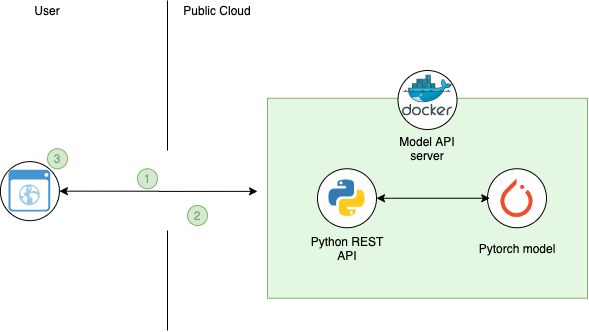
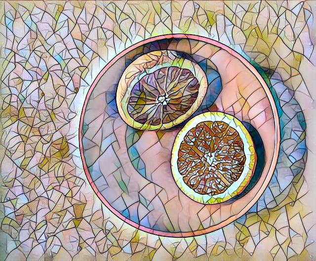
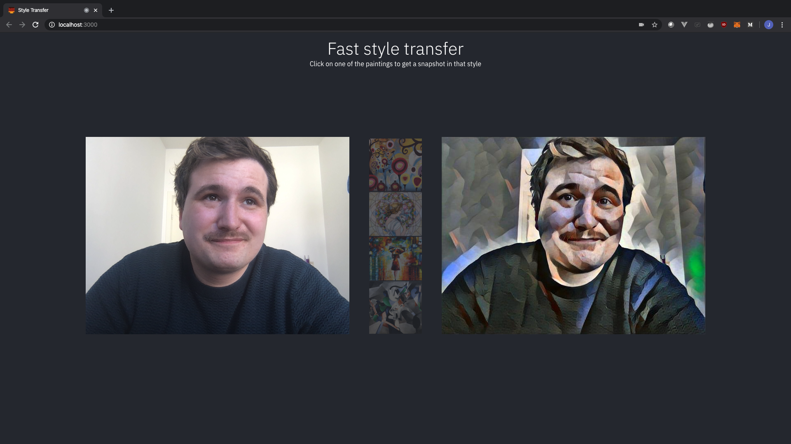

# Build a web application to utilize the MAX-fast-neural-style-transfer model.


This code pattern makes use of one of the models from the Model Asset eXchange (MAX) an exchange where developers can find and experiment with open source deep learning models. In this Code Pattern we will be utilizing the [ Fast Neural Style Transfer](https://developer.ibm.com/technologies/artificial-intelligence/models/max-fast-neural-style-transfer/) model to create a web application which will be used to capture and style images according to a specific painting style. The application provides an interactive user interface on a headless React frontend application with a lightweight nodejs [http server](https://www.npmjs.com/package/http-server). The server hosts a client-side web UI and uses API calls to the model from the Web UI to a REST endpoint on the deployed model. The Web UI captures an image from the users webcam and sends it to the models REST endpoint and displays the styled image on the UI. The user can choose whether to use the already deployed REST model as a reference, or choose to deploy their own model image provided on MAX. 


When the reader has completed this code pattern, they will understand how to:

- Build a docker image of the Object Detector MAX Model.
- Deploy a deep learning model with a REST endpoint.
- Style image objects using the MAX Model's REST API.
- Run a web application using the models REST API.



## Flow

2. User interacts with the Web UI by choosing image to utilize the model on and sends it to the model API.
3. Model returns object data and the Web UI displays the object as a styled image.
4. User interacts with the Web UI to view styled image. 


### Included Components

[IBM Model Asset Exchange](https://developer.ibm.com/exchanges/models/): A place for developers to find and use free and open source deep learning models.

## Featured technologies.

- React
- Node.js
- Docker

## Steps

**Prerequisites**

Before starting to deploy, you need some software to be present on your machine.

1. Docker running on you machine.
2. Node and npm (only for running the web app without docker)

In order to run the model locally, you will also need to setup your docker system to run with 6gb of ram or more, since any less will cause the application to crash.

### Run locally

**Start the Model API**

1. [Deploy the Model](#1-deploy-the-model)
2. [Experiment with the API(Optional)](#2-experiment-with-the-api-optional)

**Change the app to utilize your own instance of the model before deploying **

1. [Change the URL in the config file of the application](#change-the-app-to-utilize-your-own-instance-of-the-model-before-deploying)

**Start the Web App using Node.js**

1. [Download a local copy of the repository](#1-download-a-local-copy-of-the-repository)
2. [Install dependencies](#2-install-dependencies)
3. [Start the web app server.](#3-start-the-web-app-server)

**Start the Web App using docker**

1. [Build the docker image](#1-build-the-docker-image)
2. [Run the docker image](#2-run-the-docker-image)

### Start the model API

> NOTE: The set of instructions in this section are a modified version of the ones found on the [Style Transfer project page](https://github.com/IBM/MAX-Fast-Neural-Style-Transfer)

#### 1.  Deploy the model

To run the docker image, which automatically starts the model serving API run: 

```
docker run -it -p 5000:5000 codait/max-fast-neural-style-transfer
```

Be sure to set your docker enviornment to run with at least 6gb of ram and 4 cpu's, since using the model with any less, will result in errors from the API.

#### 2. Experiment with the API (Optional)

The API server automatically generates a swagger documentation page. To load it, go to http://0.0.0.0:5000/](http://0.0.0.0:5000/) in your browser. Here you can explore the API and  test the API by uploading your own image.

use the model/predict endpoint to load a test image and press the execute button. A binary image will then be returned.

It is also possible to test the model using the command line. A number of test images can be found in the assets folder in the root of this repository and using the mosaic style on the orange image we can use the following call:

```
curl -X POST "http://0.0.0.0:5000/model/predict?model=mosaic" -H "accept: application/json" -H "Content-Type: multipart/form-data" -F "image=@Oranges.jpg;type=image/jpeg"
```


We get the following image in return




#### Change the app to utilize your own instance of the model before deploying.

The default version fo this web app utilizes the already deployed MAX-fast model. If you wish to use the one deployed in the earlier steps, please go to /src/config.js and update the following line:

```javascript
export const config = {
  model_url: "https://max-fast-neural-style-transfer.max.us-south.containers.appdomain.cloud/model/predict"
}
```

to :

```javascript
export const config = {
  model_url: "http://localhost:5000/model/predict"
}
```


#### Start the web app using Node.js.

**Use the web application**

To start the web app using node follow the steps below.

##### 1. Download a local copy of the repository

In a terminal run the following command to download a copy of the repository.

```
$ git clone https://github.com/jacob-hougaard/MAX-fast-style-transfer-web-interface.git
```

Change directory into the repository base folder:

```
$ cd MAX-fast-style-transfer-web-interface
```

##### 2. Install dependencies

If you have Node.js and npm installed, type in the following command in the terminal:

```
$ npm install
```

##### 3. Start the web app server.

You can then start your web app by running the following in your terminal

```
npm start
```


#### Start the web app using Docker.

#####1. Build the docker image

In your terminal, run the following command:

```bash
docker build -t style-transfer-web-app .
```

#####2. Run the docker image**

When the image is done building, use the following command to get the container running:

```bash
docker run -p 3000:3000 style-transfer-web-app 
```


## Sample output

When opening you browser on http://localhost:3000 you should be presented with a page asking for permission on using your webcam. 

Upon clicking on a painting, the app will load for an amount of seconds, and afterwards, it should produce  result similar to what is seen in the image below. 



## Links

[Model Asset eXchange (MAX)](https://developer.ibm.com/exchanges/models/)

[Center for Open-Source Data & AI Technologies (CODAIT)](https://www.ibm.com/opensource/centers/codait/)

[MAX-Fast-Neural-Style-Transfer on github](https://github.com/IBM/MAX-Fast-Neural-Style-Transfer)

## Learn more 

* **Want to learn more about the model? It was inspired by the article **[Perceptual Losses for Real-Time Style Transfer and Super-Resolution](https://arxiv.org/abs/1603.08155)
* **The styling of this project was done according to [The Carbon Design system principles](https://www.carbondesignsystem.com/)**

* **Watson Studio**: Master the art of data science with IBM's [Watson Studio](https://dataplatform.cloud.ibm.com/)
* **Artificial Intelligence Code Patterns**: Enjoyed this Code Pattern? Check out our other [Artificial Intelligence Code Patterns](https://developer.ibm.com/technologies/artificial-intelligence/)


## Acknowledgement

Thanks to 

**[Urban Roth](https://www.linkedin.com/in/urbanroth/)** for coming up with the idéa for the project.

[**Simon Hald Larsen**](https://github.com/muldeber) for helping out with the code. 

[**Nick Penetreath**](https://github.com/MLnick) & [**Brendan Dwyer**](https://github.com/bdwyer2) for helping with debugging and answers to questions on the API.